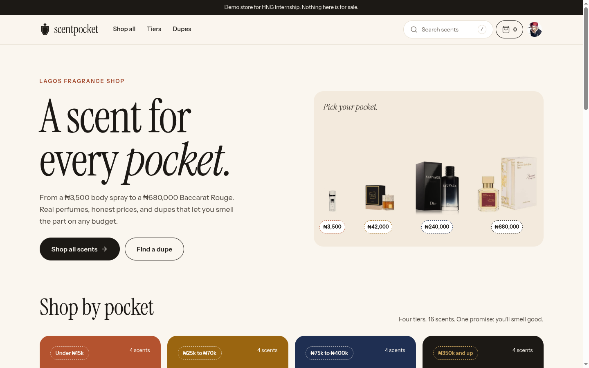
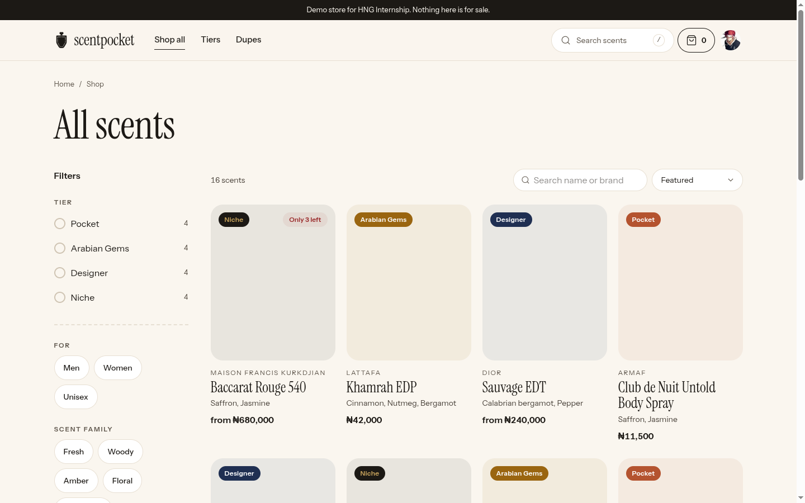
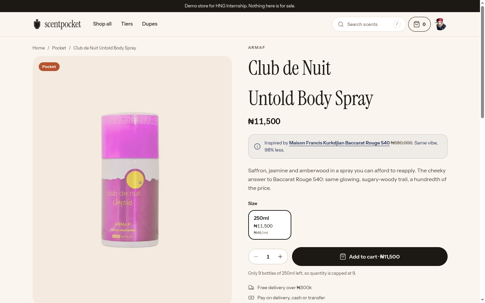
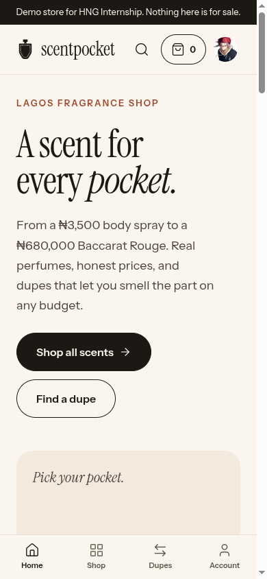
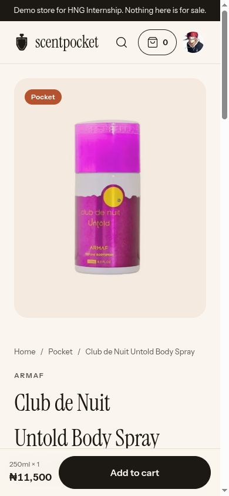

# Scentpocket

**A scent for every pocket.** A demo Lagos fragrance shop where a ₦3,500 body spray and a ₦680,000 Baccarat Rouge 540 sit side by side, organised by budget tier, with cheap dupes linked to the expensive scents they resemble.

> Demo store built for HNG Internship 15 (Lesson 2). Nothing is for sale and nothing is charged.

**Live:** https://scentpocket.com.ng · **Repo:** https://github.com/Emmanuel-Xs/scentpocket

| Home | Shop | Product |
|---|---|---|
|  |  |  |

| Home (phone) | Product (phone) |
|---|---|
|  |  |

## Brief checklist

| Requirement | How |
|---|---|
| Website for a shop | TanStack Start storefront: four budget tiers, filters, search, product pages, cart drawer |
| Checkout page | `/checkout` with three delivery zones and pay on delivery |
| Persist everything (Supabase/Neon) | Supabase Postgres via Drizzle: products, variants, images, orders, profiles |
| Confirmation emails (Mailgun) | Mailgun API on the verified `mg.scentpocket.com.ng` domain, Gmail SMTP fallback, preview on the receipt page |
| Google auth (Google Cloud Console) | Supabase Auth with a Google OAuth client |
| Past orders | `/account/orders` and a receipt per order |

## Features

* **Catalog:** 15 real perfumes in four tiers (Pocket, Arabian Gems, Designer, Niche), real Lagos prices, filters by tier, gender, scent family and occasion, search (`/` opens it), sort.
* **Dupes:** cheap scents link to the expensive ones they resemble, with the saving shown. Sold out originals point to their dupe.
* **Cart:** local (Zustand), reconciled against the server so sold out or short lines are fixed before checkout. Free delivery progress over ₦300,000.
* **Checkout:** delivery zones with fees, Nigerian phone validation, pay on delivery. One database transaction with a conditional stock decrement, so the last bottle can't be sold twice. An idempotency key makes a retried click safe.
* **Orders:** confirmation page, order history, status timeline.
* **Email:** React Email template with the logo, sent through Mailgun after the order commits. Email failure never fails an order: the provider and any error are stored on the order, and admins can resend.
* **Admin:** orders (status machine, cancel with restock, email log), products (sizes, stock, photos with WebP processing), team (owner adds and removes admins).
* **Quality:** per route SEO (canonical, Open Graph, JSON-LD, sitemap, robots), PWA manifest and icons, skeleton, empty and error states, mobile native baseline. Lighthouse on the live site: desktop 97 / 100 / 100 / 100, mobile 93 / 100 / 100 / 100 (performance, accessibility, best practices, SEO).

## Stack

TanStack Start, Router, Query and Form · React + TypeScript (strict) · Tailwind v4 + shadcn/ui · Zustand (cart only) · Zod · Supabase (Postgres, Auth, Storage) · Drizzle ORM + postgres.js · sharp · React Email · Mailgun (Nodemailer for the Gmail fallback) · NumberFlow · Sonner · Vitest · Netlify.

## How it is built

* Money is integer kobo everywhere and formatted only at the edge (`src/lib/money.ts`).
* The browser never queries app tables. Every read and write goes through a server function using Drizzle. `supabase-js` is for auth and storage only.
* Row level security is on for every table with no policies, so the public anon key reads nothing.
* Prices, delivery fees, totals, stock and roles are recomputed on the server. Every protected server function checks auth itself (`requireUser`, `requireAdmin`); route guards are only UX.
* Features live in slices: `src/features/<domain>/{components,server,schemas.ts}`; routes stay thin.

## Run locally

Needs Node 22+, npm, and the accounts listed in [docs/SETUP.md](./docs/SETUP.md) (Supabase, Google Cloud, Mailgun, Netlify).

```bash
npm install
cp .env.example .env     # fill it in, see below
npm run db:migrate       # create the schema
npm run db:seed          # catalog + product images (idempotent)
npm run dev              # http://localhost:3000
```

### Environment variables

| Variable | Notes |
|---|---|
| `VITE_SUPABASE_URL`, `VITE_SUPABASE_PUBLISHABLE_KEY` | Public; sent to the browser |
| `SITE_URL` | Public origin, e.g. `http://localhost:3000` locally, `https://scentpocket.com.ng` in production. Used for OAuth redirects and absolute email links |
| `SUPABASE_SECRET_KEY` | Server only (seeding and storage uploads) |
| `DATABASE_URL`, `DIRECT_URL` | Transaction pooler and direct connection |
| `GOOGLE_CLIENT_ID`, `GOOGLE_CLIENT_SECRET` | Used to configure Supabase Auth, not read by the app |
| `ADMIN_EMAILS` | Comma separated; these emails become owner on sign in |
| `MAILGUN_API_KEY`, `MAILGUN_DOMAIN`, `MAILGUN_API_BASE`, `MAILGUN_FROM` | See the Mailgun note below |
| `SMTP_USER`, `SMTP_APP_PASSWORD` | Gmail SMTP fallback (an app password) |
| `TEST_DATABASE_URL` | Integration tests only |

Secrets never get a `VITE_` prefix.

### Commands

| Command | Use |
|---|---|
| `npm run dev` | dev server on :3000 |
| `npm run typecheck` / `npm run lint` | static checks |
| `npm test` | unit tests (71) |
| `npm run test:int` | integration tests against `TEST_DATABASE_URL` (checkout transaction, admin) |
| `npm run db:generate` / `db:migrate` | schema changes |
| `npm run db:seed` / `db:studio` | seed and inspect data |

## Mailgun note

Mailgun sends from `mg.scentpocket.com.ng`, verified with SPF, DKIM, MX and tracking CNAME records kept in Netlify DNS. Because the domain is verified it can email any recipient. A free sandbox domain would only reach a handful of authorised addresses, so for a fresh setup either verify a domain (see [docs/SETUP.md](./docs/SETUP.md)) or rely on the Gmail SMTP fallback, which the app uses automatically when Mailgun is not configured or rejects a send.

## Admin access

Anyone whose email is in `ADMIN_EMAILS` becomes the owner on first sign in. The owner can add and remove other admins on `/admin/team`. A normal customer never sees the admin links, and every admin server function re-checks the role.

## Deploy

Netlify, deployed from the CLI: `netlify deploy --prod --build`. The domain uses Netlify DNS. Product images are served through the Netlify Image CDN (`netlify.toml` allows the Supabase storage host).

## Docs

* [Product requirements](./docs/PRD.md) · [Functional requirements](./docs/FRD.md) · [Technical design](./docs/TRD.md)
* [Design and UX](./docs/DESIGN.md) · [Catalog](./docs/CATALOG.md) · [Decisions](./docs/DECISIONS.md) · [Setup](./docs/SETUP.md)
* Progress: [context/README.md](./context/README.md)

## Test notes

Unit tests cover money, cart reconciliation, phone and order ref validation, the status machine, filters, image processing and the email render (logo, absolute links, plain text). Integration tests run the real checkout transaction, including the sold out race, against a test database. Manual click throughs on the live domain are logged in `context/README.md`.

## Known limits

Demo store: no real payments (Paystack is a stretch goal), no shipping integration, and the service worker, offline page and install sheet are not built (the manifest and icons are).
